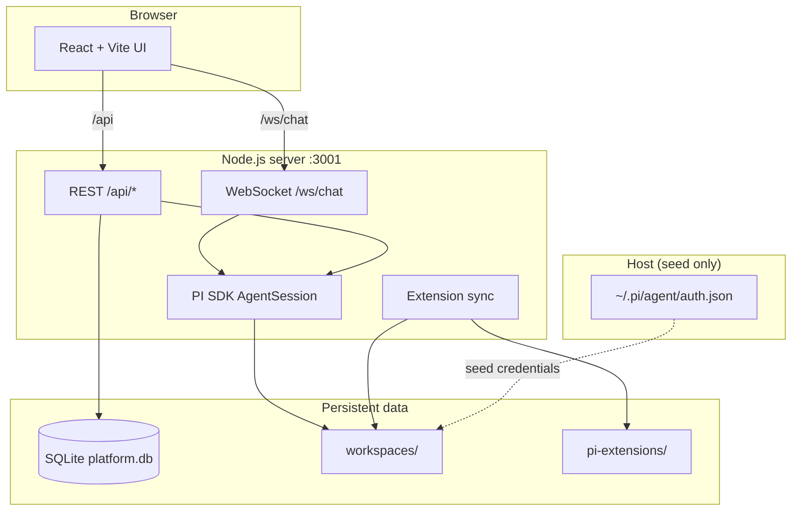

<p align="center">
  <a href="#hy-webagent">
    
  </a>
</p>

<h1 align="center">HY-Webagent</h1>

<p align="center">
  <strong>Multi-user web hub for the <a href="https://github.com/earendil-works/pi-coding-agent">PI Coding Agent</a></strong><br />
  API-key auth · isolated workspaces · streaming chat · slash commands · Monaco editor
</p>

<p align="center">
  <a href="https://nodejs.org"></a>
  <a href="https://react.dev"></a>
  <a href="https://vite.dev"></a>
  <a href="LICENSE"></a>
</p>

<!-- language switcher: GitHub renders badge links; English is the default section at the top -->
<p align="center">
  <a href="#hy-webagent"></a>
  <a href="#hy-webagent-中文"></a>
</p>

<p align="center">
  <a href="#quick-start">Quick Start</a> ·
  <a href="#architecture">Architecture</a> ·
  <a href="#configuration">Configuration</a> ·
  <a href="#deployment">Deployment</a> ·
  <a href="#security">Security</a> ·
  <a href="#hy-webagent-中文">中文文档</a>
</p>

---

<a id="hy-webagent"></a>

## Overview

**HY-Webagent** (`pi-web-platform`) turns [PI Coding Agent](https://github.com/earendil-works/pi-coding-agent) into a browser-based, multi-tenant coding environment. Each user signs in with an API key, gets an isolated workspace, and talks to PI over WebSocket streaming — with a file tree, Monaco editor, and a `/` slash-command palette comparable to the PI CLI.

Built for teams or labs that want a self-hosted agent hub without giving every user shell access to the host.

## Features

- **Multi-user API-key auth** — per-user sessions, roles (`user` / `admin`), optional budgets and model templates
- **Workspace isolation** — separate `projects/`, `.pi/sessions/`, skills, and agent config per account
- **Streaming web chat** — real-time assistant output, tool calls, thinking blocks, extension UI widgets
- **Slash commands** — `/model`, `/settings`, `/new`, `/tree`, `/compact`, `/export`, plus PI-discovered prompts, skills, and extensions
- **File workspace** — browse and edit under `projects/` with Monaco; downloads via signed API paths
- **Bundled PI extensions** — shipped in `pi-extensions/`, synced into each user on workspace init
- **Admin tooling** — CLI (`npm run admin`) and HTTP admin APIs for users, usage, and model policy

## Quick Start

**Requirements:** Node.js **22+**, npm, and a host-level PI credential file at `~/.pi/agent/auth.json` (seeded into user workspaces). See [Configuration](#configuration).

```bash
git clone <your-repo-url> pi-web-platform
cd pi-web-platform

npm run install:all
npm run dev
```

| Mode | Command | Open |
|------|---------|------|
| **Development** | `npm run dev` | http://localhost:5173 (Vite proxies API + WS) |
| **Production** | `npm run prod` | http://localhost:3001 (single Node process, static UI + API) |
| **Docker** | `docker compose up --build` | http://localhost:3001 |

On first boot the server creates an **admin** user if the database is empty. The bootstrap API key is printed **once** to stdout — save it immediately.

```bash
# Health check
curl -s http://localhost:3001/health | jq .

# Admin CLI (examples)
npm run admin -- help
npm run admin -- users list
```

## Architecture



```
pi-web-platform/
├── client/          React 19 + Vite 8 + Tailwind 4
├── server/          Express + WebSocket + @earendil-works/pi-coding-agent
├── pi-extensions/   Bundled agent extensions (synced per user)
├── admin-skills/    Admin-only PI skills (platform ops)
├── data/            Runtime DB, usage, logs (gitignored)
├── workspaces/      Per-user sandboxes (gitignored)
└── docs/            Design & security notes
```

## Slash commands

Type `/` in the composer to open the command menu.

| Command | Description |
|---------|-------------|
| `/model` | Model picker |
| `/settings` | Thinking level, steering / follow-up mode |
| `/name <name>` | Rename session |
| `/new` | New session |
| `/resume` | Session history |
| `/fork` | Fork from tree node |
| `/tree` | Conversation tree |
| `/compact` | Compact history |
| `/session` | Session stats |
| `/copy` | Copy last assistant message |
| `/export [html\|jsonl] [path]` | Export session |
| `/import <path>` | Import JSONL |

Dynamic entries are discovered from workspace `.pi/prompts/`, `.pi/skills/`, and loaded PI extensions. See [`docs/slash-commands.md`](docs/slash-commands.md).

## Configuration

Copy [`.env.example`](.env.example) to `.env` and adjust as needed.

| Variable | Default | Description |
|----------|---------|-------------|
| `PORT` | `3001` | HTTP + WebSocket port |
| `CORS_ORIGIN` | `http://localhost:5173` | Allowed browser origin (use your public URL in prod) |
| `WORKSPACE_ROOT` | `../workspaces` | User workspace root |
| `DATABASE_PATH` | `../data/platform.db` | SQLite database |
| `ADMIN_KEY` | *(unset)* | Optional break-glass master key; must be ≥16 chars if set |
| `PI_EXTENSIONS_ROOT` | `./pi-extensions` | Bundled extension source |
| `MAX_CONCURRENT_USERS` | `4` | Soft concurrency cap |
| `SESSION_TIMEOUT_HOURS` | `24` | Idle session timeout |

**LLM credentials** are read from PI's standard `auth.json` format. On the host:

```json
{
  "deepseek": { "type": "api_key", "key": "sk-..." },
  "jina": { "type": "api_key", "key": "jina_..." }
}
```

Place this at `~/.pi/agent/auth.json`. The platform seeds provider keys into each user's `workspace/.pi/agent/auth.json` according to role and model template policy.

Optional extension-related env vars: `VISION_MODEL` (for `image-viewer`). Jina tools read the `jina` entry from `auth.json`, not a separate env var.

## Deployment

### Production (single process)

```bash
npm run install:all
npm run prod        # build client + server, serve UI from :3001
```

Set `CORS_ORIGIN` to your public origin (e.g. `https://pi.example.com`) when not using a reverse proxy on the same host.

### Docker Compose

```bash
docker compose up --build
```

Mount `~/.pi/agent` read-only for credential seeding (see `docker-compose.yml`). Persist `./data` and `./workspaces`.

### Reverse proxy

Terminate TLS at nginx or Caddy and proxy:

- `/` → static (optional if using `npm run prod`)
- `/api/` → Node `:3001`
- `/ws/` → WebSocket upgrade to Node `:3001`

## Development

```bash
npm run install:all
npm run dev              # backend :3001 + frontend :5173

npm run test:server      # in server/
npm run test:client      # in client/
npm run sync:pi-local    # copy pi-extensions → ~/.pi/agent for PI CLI dev
```

## PI extensions

Custom extensions live in [`pi-extensions/`](pi-extensions/). They are copied into each user's agent directory on workspace init. Details: [`pi-extensions/README.md`](pi-extensions/README.md).

## Security

This project is **under active development**. Before exposing it to untrusted users on the public internet, read [`docs/security-remediation.md`](docs/security-remediation.md).

In short:

- Agent tools (`bash`, file I/O) run on the **host process** — treat workspace isolation as a convenience layer, not a hard sandbox, unless you add container/namespace isolation.
- Never commit `data/`, `workspaces/`, or `.env`.
- Rotate bootstrap admin keys and LLM credentials if they may have leaked.

**Do not** deploy multi-tenant production without reviewing that document.

## Contributing

Contributions welcome. Please keep changes focused, match existing TypeScript/React style, and run server/client tests before opening a PR.

1. Fork and create a feature branch
2. `npm run test:server` / `npm run test:client`
3. Open a PR with a clear description and test plan

## License

[MIT](LICENSE) © 2026 kumo

---

<a id="hy-webagent-中文"></a>

<!-- 中文文档：点击顶部「中文」徽章跳转至此 -->

<p align="center">
  <a href="#hy-webagent"></a>
  <a href="#hy-webagent-中文"></a>
</p>

<h1 align="center">HY-Webagent</h1>

<p align="center">
  <strong>面向 <a href="https://github.com/earendil-works/pi-coding-agent">PI Coding Agent</a> 的多用户 Web 平台</strong><br />
  API Key 登录 · 工作区隔离 · 流式对话 · Slash 命令 · Monaco 编辑器
</p>

<p align="center">
  <a href="#概述">概述</a> ·
  <a href="#功能">功能</a> ·
  <a href="#快速开始">快速开始</a> ·
  <a href="#架构">架构</a> ·
  <a href="#配置">配置</a> ·
  <a href="#部署">部署</a> ·
  <a href="#安全">安全</a> ·
  <a href="#hy-webagent">English</a>
</p>

---

<a id="概述"></a>

## 概述

**HY-Webagent**（仓库名 `pi-web-platform`）把 [PI Coding Agent](https://github.com/earendil-works/pi-coding-agent) 包装成浏览器里的多租户编码环境。用户用 API Key 登录，在隔离工作区里通过 WebSocket 与 PI 流式对话，并享有文件树、Monaco 编辑器和与 PI CLI 相近的 `/` 命令体验。

适合需要在自托管环境中小范围共享 Agent 能力、但不希望所有用户直接登录宿主机 Shell 的场景。

<a id="功能"></a>

## 功能

- **多用户 API Key 认证** — 会话、角色（`user` / `admin`）、可选预算与模型模板
- **工作区隔离** — 每账号独立的 `projects/`、`.pi/sessions/`、skills 与 agent 配置
- **流式 Web 聊天** — 助手输出、工具调用、思考块、扩展 UI 组件
- **Slash 命令** — `/model`、`/settings`、`/new`、`/tree`、`/compact`、`/export` 等，以及 PI 自动发现的 prompt / skill / 扩展命令
- **文件工作区** — 在 `projects/` 下浏览与编辑；下载走受控 API
- **内置 PI 扩展** — `pi-extensions/` 随仓库分发，workspace 初始化时同步到用户目录
- **管理工具** — CLI（`npm run admin`）与 HTTP 管理 API（用户、用量、模型策略）

<a id="快速开始"></a>

## 快速开始

**环境要求：** Node.js **22+**、npm，以及宿主机 `~/.pi/agent/auth.json`（用于向用户工作区种子同步凭证）。详见[配置](#配置)。

```bash
git clone <your-repo-url> pi-web-platform
cd pi-web-platform

npm run install:all
npm run dev
```

| 模式 | 命令 | 访问地址 |
|------|------|----------|
| **开发** | `npm run dev` | http://localhost:5173（Vite 代理 API / WS） |
| **生产** | `npm run prod` | http://localhost:3001（单进程：静态前端 + API） |
| **Docker** | `docker compose up --build` | http://localhost:3001 |

首次启动且数据库为空时，会自动创建 **admin** 用户；bootstrap API Key **仅打印一次**到 stdout，请立即保存。

```bash
curl -s http://localhost:3001/health | jq .

npm run admin -- help
npm run admin -- users list
```

<a id="架构"></a>

## 架构

结构与英文版相同：浏览器（React）↔ Node 服务（REST + WebSocket）↔ PI SDK ↔ SQLite + `workspaces/`；`pi-extensions/` 在 init 时同步；`~/.pi/agent/auth.json` 仅作凭证种子源。

```
pi-web-platform/
├── client/          React 19 + Vite 8 + Tailwind 4
├── server/          Express + WebSocket + PI SDK
├── pi-extensions/   内置 Agent 扩展
├── admin-skills/    管理员专用 skill
├── data/            运行时数据库（gitignore）
└── workspaces/      用户沙箱（gitignore）
```

<a id="配置"></a>

## 配置

复制 [`.env.example`](.env.example) 为 `.env` 并按需修改。

| 变量 | 默认值 | 说明 |
|------|--------|------|
| `PORT` | `3001` | HTTP / WebSocket 端口 |
| `CORS_ORIGIN` | `http://localhost:5173` | 允许的前端来源 |
| `WORKSPACE_ROOT` | `../workspaces` | 用户工作区根目录 |
| `DATABASE_PATH` | `../data/platform.db` | SQLite 路径 |
| `ADMIN_KEY` | *(未设置)* | 可选应急主密钥；若设置则 ≥16 字符 |
| `PI_EXTENSIONS_ROOT` | `./pi-extensions` | 内置扩展目录 |

**LLM 凭证** 使用 PI 标准 `auth.json` 格式，放在宿主机 `~/.pi/agent/auth.json`：

```json
{
  "deepseek": { "type": "api_key", "key": "sk-..." },
  "jina": { "type": "api_key", "key": "jina_..." }
}
```

平台会按用户角色与模型模板，将相应 provider 种子同步到 `workspace/.pi/agent/auth.json`。Jina 扩展读取其中的 `jina` 条目。

<a id="部署"></a>

## 部署

```bash
npm run install:all
npm run prod
```

Docker：`docker compose up --build`，持久化 `./data` 与 `./workspaces`，并挂载 `~/.pi/agent:ro` 供凭证种子。

生产环境建议在前方加 nginx/Caddy 做 HTTPS，并将 `CORS_ORIGIN` 设为实际访问域名。

<a id="安全"></a>

## 安全

项目**仍在积极开发中**。在对公网不可信用户开放前，请务必阅读 [`docs/security-remediation.md`](docs/security-remediation.md)。

要点：

- Agent 的 `bash` / 文件工具跑在**宿主机进程**里；在未加容器或命名空间隔离前，不要把它当成硬沙箱。
- 切勿提交 `data/`、`workspaces/`、`.env`。
- 若凭证可能泄露，请轮换 admin API Key 与 LLM Key。

## 参与贡献

欢迎 PR。请保持改动聚焦、遵循现有代码风格，并在提交前运行测试。

## 许可证

[MIT](LICENSE) © 2026 kumo

---

<p align="center">
  <sub>HY-Webagent · built on <a href="https://github.com/earendil-works/pi-coding-agent">PI Coding Agent</a></sub>
</p>
